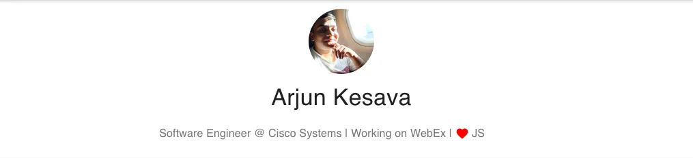

# Welcome to my personal space

  

This repo is the source of [roboarjun.dev](https://roboarjun.dev).
You can check the live version over there.

Please feel free to fork / contribute to this repo

## Tech Specs

- This website is built using [React JS](https://reactjs.org) `v16.13.1`.
- For css, I had used [material ui](https://material-ui.com/) css framework.
- All the images in this repo are of `.webp` format only.

## To Do List

- [x] About ME
- [ ] Dark mode
- [ ] Gatsby
- [ ] Obfuscate CSS
- [ ] Blogs
